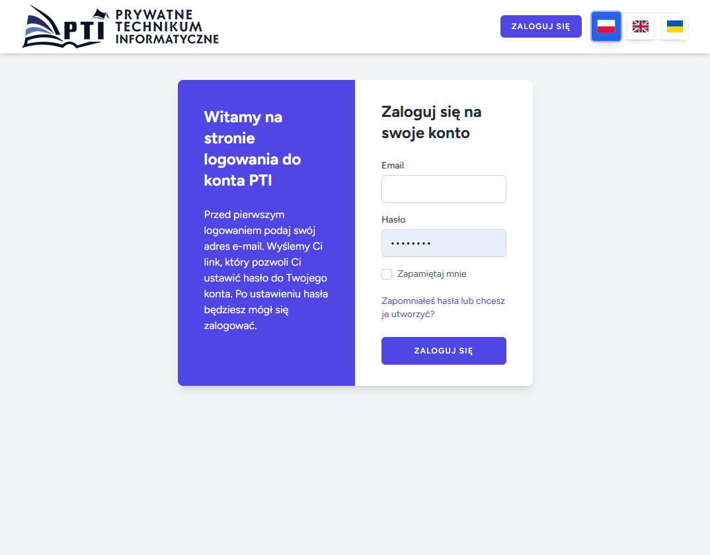
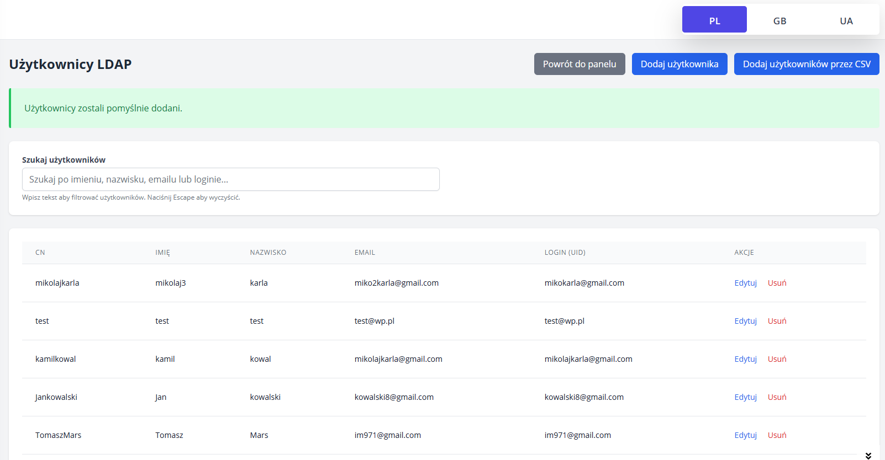

# Auth PTI - System Uwierzytelniania LDAP

System uwierzytelniania dla Prywatnego Technikum Informatycznego integrujący Laravel z LDAP oraz panel administracyjny do zarządzania użytkownikami.

## 📋 Spis treści

- [Opis projektu](#opis-projektu)
- [Funkcjonalności](#funkcjonalności)
- [Technologie](#technologie)
- [Wymagania](#wymagania)
- [Instalacja](#instalacja)
- [Konfiguracja](#konfiguracja)
- [Zrzuty ekranu](#zrzuty-ekranu)
- [Struktura projektu](#struktura-projektu)
- [Licencja](#licencja)

## 🎯 Opis projektu

Auth PTI to system uwierzytelniania zbudowany w Laravel, zaprojektowany specjalnie dla środowiska PTI, aby uczniowie mogli mieć własnego użytkownika w sali. System integruje się z serwerem LDAP, umożliwiając centralne zarządzanie użytkownikami i bezpieczne uwierzytelnianie.

## ✨ Funkcjonalności

### 🔐 System uwierzytelniania
- **Logowanie LDAP** - integracja z serwerem katalogowym PTI
- **Rate limiting** - ochrona przed atakami brute force
- **Logowanie aktywności** - szczegółowe logi prób logowania
- **Pamiętaj mnie** - opcja zapamiętania sesji
- **Walidacja w czasie rzeczywistym** - błędy wyświetlane w formularzu

### 👥 Panel administracyjny
- **Zarządzanie użytkownikami** - dodawanie, edycja, usuwanie użytkowników LDAP
- **Intuicyjny interfejs** - nowoczesny design z Tailwind CSS
- **Grupowanie użytkowników** - organizacja według jednostek organizacyjnych
- **Wyszukiwanie i filtrowanie** - szybkie znajdowanie użytkowników

### 🛡️ Bezpieczeństwo
- **Szyfrowanie haseł** - bezpieczne przechowywanie danych
- **Kontrola sesji** - zarządzanie sesjami użytkowników
- **CSRF Protection** - ochrona przed atakami CSRF

## 🚀 Technologie

- **Backend**: Laravel 10.x, PHP 8.1+
- **Frontend**: Blade Templates, Tailwind CSS
- **LDAP**: LdapRecord package
- **Admin Panel**: Custom Admin Package -oparte na SleepingOwl
- **Database**: MySQL
- **Containerization**: Docker & Docker Compose

## 📋 Wymagania

- PHP >= 8.1
- Composer
- Node.js & NPM
- MySQL/PostgreSQL
- Serwer LDAP
- Docker (opcjonalnie)

## 🔧 Instalacja

### Standardowa instalacja

```bash
# Sklonuj repozytorium
git clone https://github.com/labapawel/auth.ptibb.edu.pl.git
cd auth.ptibb.edu.pl

# Zainstaluj zależności PHP
composer install

# Zainstaluj zależności JavaScript
npm install

# Skopiuj plik środowiska
cp .env.example .env

# Wygeneruj klucz aplikacji
php artisan key:generate

# Skonfiguruj bazę danych i LDAP w .env
# Uruchom migracje
php artisan migrate

# Zbuduj zasoby frontend
npm run build

# Uruchom serwer
php artisan serve
```

### Instalacja z Docker

```bash
# Zbuduj i uruchom kontenery
docker-compose up -d

# Zainstaluj zależności w kontenerze
docker-compose exec app composer install
docker-compose exec app php artisan key:generate
docker-compose exec app php artisan migrate
```

## ⚙️ Konfiguracja

### Konfiguracja LDAP

Edytuj plik `.env`:

```env
# Konfiguracja LDAP
LDAP_HOST=ldap.example.edu.pl
LDAP_USERNAME="cn=admin,dc=example,dc=edu,dc=pl"
LDAP_PASSWORD=your_ldap_password
LDAP_PORT=389
LDAP_BASE_DN="dc=example,dc=edu,dc=pl"
LDAP_TIMEOUT=5
LDAP_SSL=false
LDAP_TLS=false
```

### Konfiguracja bazy danych

```env
DB_CONNECTION=mysql
DB_HOST=127.0.0.1
DB_PORT=3306
DB_DATABASE=auth_pti
DB_USERNAME=your_username
DB_PASSWORD=your_password
```

## 📸 Zrzuty ekranu

### Strona logowania


Nowoczesna strona logowania z:
- Responsywnym designem
- Walidacją w czasie rzeczywistym
- Obsługą błędów i komunikatów
- Opcją "Pamiętaj mnie"
- Linkiem do resetowania hasła oraz tworzenia konta Ldap po raz pierwszy

### Panel administracyjny - Zarządzanie użytkownikami


Zaawansowany panel do zarządzania użytkownikami zawierający:
- Listę wszystkich użytkowników LDAP
- Możliwość dodawania nowych użytkowników
- Możliwość dodania użytkowników poprzez csv
- Edycję istniejących kont
- Wyszukiwanie i filtrowanie

## 📁 Struktura projektu

```
laravel-auth-pti/
├── app/
│   ├── Http/
│   │   ├── Controllers/Auth/          # Kontrolery uwierzytelniania
│   │   ├── Requests/Auth/             # Walidacja żądań logowania
│   │   └── Middleware/                # Middleware aplikacji
│   ├── Ldap/                         # Modele LDAP
│   │   ├── User.php                  # Model użytkownika LDAP
│   │   ├── Group.php                 # Model grup LDAP
│   │   └── OrganizationalUnit.php    # Model jednostek organizacyjnych
│   ├── Models/                       # Modele Eloquent
│   ├── Jobs/                         # Zadania w tle
│   └── Mail/                         # Szablony email
├── config/
│   ├── auth.php                      # Konfiguracja uwierzytelniania
│   ├── ldap.php                      # Konfiguracja LDAP
│   └── sleeping_owl.php              # Konfiguracja panelu admin
├── resources/
│   ├── views/auth/                   # Widoki uwierzytelniania
│   ├── lang/                         # Pliki językowe
│   └── css/                          # Style CSS
├── routes/
│   ├── web.php                       # Trasy webowe
│   └── auth.php                      # Trasy uwierzytelniania
├── docker/                           # Konfiguracja Docker
├── public/                          # Zasoby publiczne
└── database/
    ├── migrations/                   # Migracje bazy danych
    └── seeders/                      # Dane testowe
```

## 🔒 Bezpieczeństwo

### Funkcje bezpieczeństwa

- **Rate Limiting**: Ograniczenie prób logowania (5 prób na użytkownika)
- **CSRF Protection**: Ochrona przed atakami Cross-Site Request Forgery
- **Session Security**: Bezpieczne zarządzanie sesjami użytkowników
- **Password Hashing**: Bezpieczne hashowanie haseł
- **SSL/TLS Support**: Obsługa szyfrowanego połączenia z LDAP
- **Input Validation**: Walidacja wszystkich danych wejściowych
- **Error Logging**: Szczegółowe logowanie błędów i prób logowania

### Logowanie i monitoring

Aplikacja loguje wszystkie istotne zdarzenia:

```php
// Przykłady logów w storage/logs/laravel.log
[2025-10-07 10:30:15] local.INFO: Successful login for username: jkowalski from IP: 192.168.1.100
[2025-10-07 10:30:45] local.INFO: Failed login attempt for username: admin from IP: 192.168.1.105
[2025-10-07 10:31:00] local.WARNING: User jkowalski rate limited from IP: 192.168.1.100
```

## 🚀 Uruchamianie w produkcji

### Konfiguracja serwera

```bash
# Optymalizacja dla produkcji
php artisan config:cache
php artisan route:cache
php artisan view:cache
php artisan optimize

# Ustawienia środowiska produkcyjnego
APP_ENV=production
APP_DEBUG=false
```

### Deployment

Projekt zawiera skrypty deployment:

```bash
# Linux/Mac
./deploy.sh

# Windows
deploy.bat
```
### Przyszłe kroki:

- Testy jednostkowe
- Więcej możliwości w grupach - admin page
- przerzucenie crud'ów wszystkich na workera (aktualnie tylko userzy są)

---

**Auth PTI** - Bezpieczne uwierzytelnianie dla środowiska szkolnego 🎓
